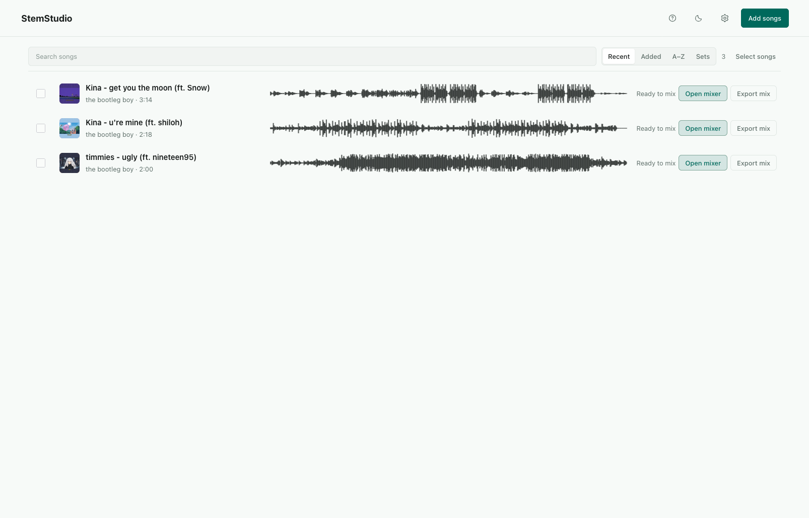
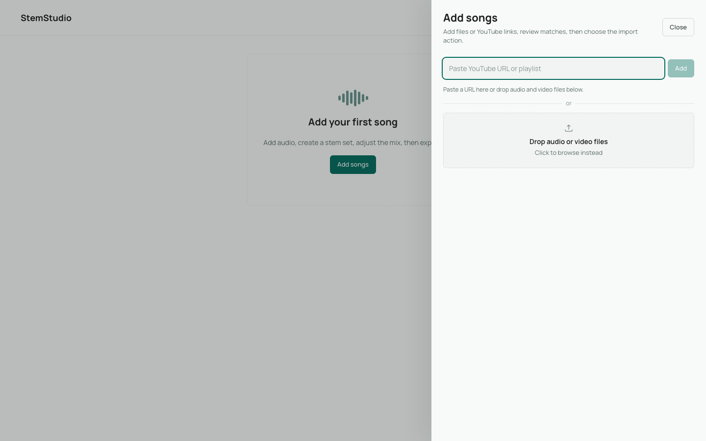
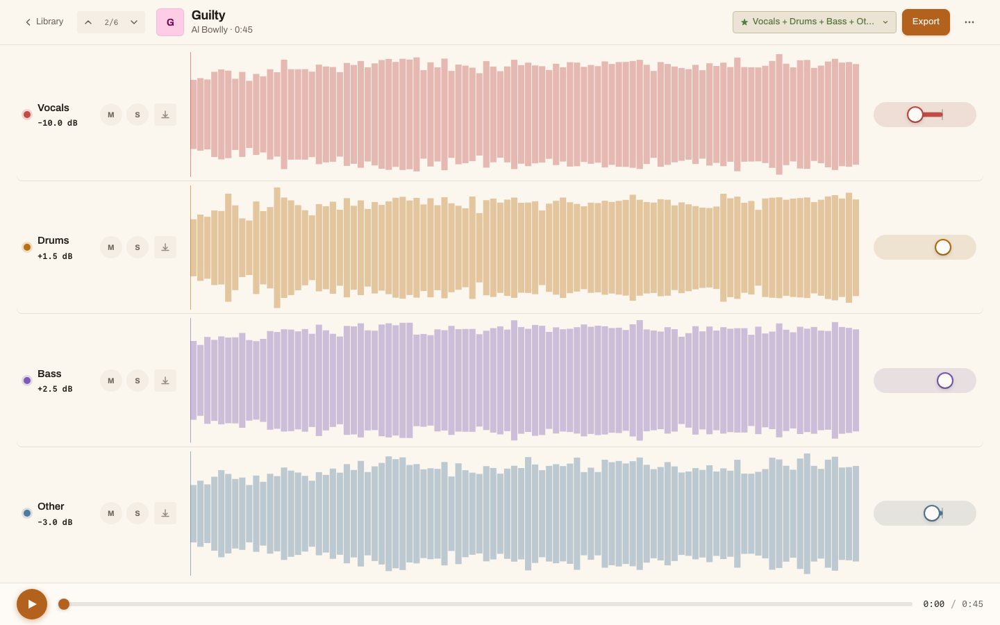

# StemStudio

StemStudio is a local app for splitting songs into stems, comparing separation runs, shaping a mix, and exporting the result. It runs on your machine. Source audio, generated stems, exports, logs, and the SQLite database stay under `data/` by default.

Created by [Samuel Spithorst](https://spithorst.net).

## Screenshots

Screenshots use demo library data so the repository can show the main flows without exposing personal audio metadata.

First-run library:



Add songs:



Shape a mix:



## What It Does

- Import local audio files, videos, or YouTube links.
- Queue one song or a batch of songs for stem separation.
- Choose the stem set and quality level for each run.
- Compare completed runs and keep the one you prefer.
- Adjust stem gain, mute stems, and save a custom mix.
- Export WAV, MP3, individual stems, source files, or bundles.
- Clean temporary files, export bundles, and old non-preferred runs from the app.

## Requirements

You need:

- macOS or another Unix-like local development environment.
- Node.js 20 or newer.
- npm 10 or newer.
- Python 3.10 or newer.
- `ffmpeg` and `ffprobe` for audio inspection, conversion, waveform metrics, and mixing.

StemStudio does not support Windows yet. The setup and run scripts expect a Unix shell.

You may also want:

- `yt-dlp` for local YouTube import.
- `audio-separator` for real stem separation.

Install system tools first. On macOS:

```sh
brew install ffmpeg yt-dlp
```

On Debian or Ubuntu:

```sh
sudo apt-get install ffmpeg
```

## Quick Start

Check your system before installing app dependencies:

```sh
npm run check:system
```

Install JavaScript dependencies, run the system check, create `.venv`, and install the backend:

```sh
npm run setup
```

Start the API, worker, and Vite frontend:

```sh
npm run dev
```

Open:

- Frontend: `http://127.0.0.1:5173`
- API: `http://127.0.0.1:8000`

## Full Stem Separation Setup

StemStudio can import and organize songs without `audio-separator`, but real separation needs the processing dependency. Run this after `npm run setup`:

```sh
npm run setup:processing
```

The first real separation run can take longer because the separation model may download into `data/cache/models`. That cache can become large and is ignored by git.

If processing fails, open the diagnostics panel in the app and check that the worker sees the same binaries and Python environment you installed.

Do not run `pip install -e ".[processing]"` directly unless you have already activated the project virtual environment. The safer command is:

```sh
.venv/bin/python -m pip install -e '.[processing]'
```

## Configuration

The default local setup works without a `.env` file. Copy the example only when you need custom paths or binary names:

```sh
cp .env.example .env
```

Runtime settings use the `STEMSTUDIO_` prefix. The most useful values are:

- `STEMSTUDIO_FRONTEND_ORIGIN`
- `STEMSTUDIO_DATA_ROOT`
- `STEMSTUDIO_DATABASE_PATH`
- `STEMSTUDIO_UPLOADS_DIR`
- `STEMSTUDIO_OUTPUT_DIR`
- `STEMSTUDIO_EXPORTS_DIR`
- `STEMSTUDIO_TEMP_DIR`
- `STEMSTUDIO_MODEL_CACHE_DIR`
- `STEMSTUDIO_FFMPEG_BINARY`
- `STEMSTUDIO_FFPROBE_BINARY`
- `STEMSTUDIO_SEPARATOR_BINARY`
- `STEMSTUDIO_YT_DLP_BINARY`

See [.env.example](./.env.example) for the defaults.

## Development

Useful commands:

```sh
npm run check:system
npm run setup
npm run setup:processing
npm run dev
npm run lint
npm run typecheck
npm run build
npm run check
```

`npm run check` runs frontend linting, frontend typecheck, the production build, and a backend compile check. The project does not have a formal test suite yet.

## Project Layout

```text
backend/              FastAPI API, SQLAlchemy models, services, worker code
frontend/             React and Vite app
scripts/              Local helper scripts
docs/                 Planning notes and screenshots
data/                 Runtime database, uploads, outputs, exports, logs, caches
```

Only `.gitkeep` files under `data/` belong in git. Do not commit uploaded audio, generated stems, model cache files, exports, logs, or `data/app.db`.

## How It Works

StemStudio has three local processes:

1. The Vite frontend renders the library, import review, mix workspace, and settings.
2. The FastAPI backend owns imports, metadata, settings, exports, and file access.
3. The worker claims queued separation runs, calls the separator, writes artifacts, and updates run status.

SQLite stores app state in `data/app.db`. Audio and generated artifacts stay on disk under `data/`.

## Data, Privacy, and Rights

StemStudio is a local tool. It does not upload your files to a hosted StemStudio service.

You are responsible for the audio you process. Use files and URLs only when you have the rights and platform permission to download, process, separate, and export them. YouTube import uses `yt-dlp` locally; that does not remove your responsibility to follow YouTube terms, copyright law, and any licenses that apply to the source material.

Do not publish a public StemStudio service with YouTube import enabled unless you have reviewed the platform and legal requirements for that use.

## Contributing

Read [CONTRIBUTING.md](./CONTRIBUTING.md) before opening a pull request.

Keep changes small, remove dead code, and favor clear local workflows over broad abstractions. Run the checks listed above before sharing a change.

## Troubleshooting

If diagnostics report a missing binary, install it and restart the API and worker.

If the app cannot process audio, confirm that `ffmpeg`, `ffprobe`, and `audio-separator` are available inside the same Python environment used by `scripts/run-python.sh`.

If pip says `Package 'stemstudio' requires a different Python`, you are using the wrong Python or pip. Run `npm run setup` first, then install processing support with `npm run setup:processing`.

If the frontend cannot reach the API, confirm that the API is running on `127.0.0.1:8000` and that `STEMSTUDIO_FRONTEND_ORIGIN` matches the frontend URL.

## License

StemStudio is licensed under the GNU Affero General Public License v3.0. See [LICENSE](./LICENSE).
