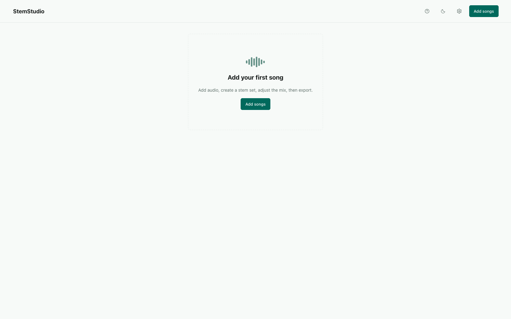
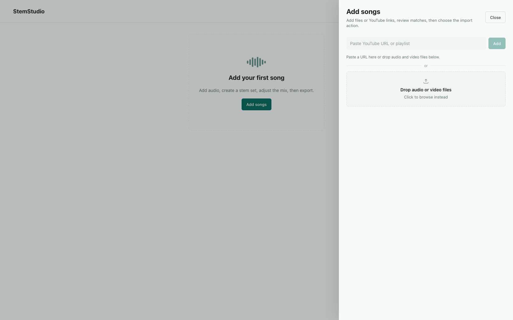

# StemStudio

StemStudio is a FOSS macOS desktop app for splitting songs into stems, comparing separation runs, shaping a mix, and exporting the result. The built app launches its bundled API and worker internally. Source audio, generated stems, exports, logs, and the SQLite database stay on your machine under macOS Application Support.

Created by [Samuel Spithorst](https://spithorst.net).

## Project Status

StemStudio is free and open-source software for a local macOS app. The project welcomes focused contributions to the desktop workflow, separation and export behavior, local file handling, public YouTube URL import, build scripts, documentation, and UI clarity.

The app does not support Windows, Linux, hosted processing, accounts, public file URLs, remote workers, billing, or multi-tenant storage. Keep contributions inside the local desktop product unless the project direction changes first.

## Screenshots

Screenshots use demo library data so the repository can show the main flows without exposing personal audio metadata.

Empty library:



Add songs:



Review imports:


Library with separated songs:


Shape a mix:


## What It Does

- Import local audio files, videos, or public YouTube URLs.
- Queue one song or a batch of songs for stem separation.
- Choose the stem set and quality level for each run.
- Compare completed runs and keep the one you prefer.
- Adjust stem gain, mute stems, and save a custom mix.
- Export WAV, MP3, individual stems, source files, or bundles.
- Clean temporary files, export bundles, and old non-preferred runs from the app.

## Requirements

For local setup and development:

- macOS.
- Node.js 20 or newer.
- npm 10 or newer.
- Python 3.11 or newer. The build scripts create and manage the project virtual environment.
- Xcode Command Line Tools for macOS binary validation. Install with `xcode-select --install`.

For release packaging:

- A Developer ID Application signing identity.
- Apple notarization credentials.

StemStudio does not support Windows or Linux desktop builds yet.

## Download

Download signed macOS builds from [GitHub Releases](https://github.com/Samuwhale/stemstudio/releases). Source setup is below for contributors and users who want to build locally.

## First Setup

From a fresh clone, run:

```sh
npm run setup:local
```

This installs JavaScript dependencies, creates the Python environment, builds the bundled desktop runtime, builds the frontend, and runs the desktop package doctor. Rerun it any time setup feels broken or the app reports a missing runtime.

Open the local desktop app:

```sh
npm run desktop:run
```

## Build The App

For release packaging, you can run the same steps individually.

Install JavaScript dependencies:

```sh
npm install
```

Build the bundled Python runtime:

```sh
npm run desktop:runtime
```

Build the frontend and verify package inputs:

```sh
npm run build
npm run desktop:doctor
```

Build the signed DMG and zip:

```sh
npm run desktop:build:mac
```

`desktop:build:mac` automatically runs the runtime build, frontend build, package doctor, and Electron packaging. It loads `.env.notarization` when that ignored local file exists. Use either `APPLE_API_KEY`, `APPLE_API_KEY_ID`, and `APPLE_API_ISSUER`, or `APPLE_ID`, `APPLE_APP_SPECIFIC_PASSWORD`, and `APPLE_TEAM_ID`. Code signing can use `CSC_LINK` and `CSC_KEY_PASSWORD`, `CSC_NAME`, or a Developer ID Application identity in the macOS keychain.

Example `.env.notarization`:

```sh
export APPLE_API_KEY="/absolute/path/to/AuthKey_KEYID.p8"
export APPLE_API_KEY_ID="KEYID"
export APPLE_API_ISSUER="issuer-uuid"
```

Build outputs are written to `release/`.

## Checks

Use:

```sh
npm run check
```

`npm run check` runs frontend linting, frontend typecheck, a production frontend build, and a backend compile check.

## Project Layout

```text
desktop/             Electron shell, packaging config, entitlements
backend/             Bundled FastAPI API, SQLAlchemy models, services, worker code
frontend/            React app built into the Electron bundle
scripts/             Build, runtime packaging, and signing helper scripts
docs/                Design principles and screenshots
data/                Ignored development scratch data only
```

Only `.gitkeep` files under `data/` belong in git. Do not commit uploaded audio, generated stems, model cache files, exports, logs, or `data/app.db`.

## How It Works

The Electron app starts two bundled child processes:

1. The FastAPI backend owns imports, metadata, settings, exports, and file access.
2. The worker claims queued separation runs, calls the separator, writes artifacts, and updates run status.

The React frontend is loaded from the app bundle. It receives the API URL and launch token from Electron preload IPC.

SQLite stores app state under the app support directory. Audio and generated artifacts stay on disk in StemStudio-managed folders.

## Data, Privacy, and Rights

StemStudio is a local FOSS tool. It does not upload your files to a hosted StemStudio service.

You are responsible for the audio you process. Use files and public YouTube URLs only when you have the rights and platform permission to download, process, separate, and export them. YouTube import uses bundled `yt-dlp`; that does not remove your responsibility to follow YouTube terms, copyright law, and any licenses that apply to the source material.

Do not publish a public StemStudio service with YouTube import enabled unless you have reviewed the platform and legal requirements for that use.

StemStudio executes bundled local binaries such as `ffmpeg`, `ffprobe`, `yt-dlp`, and `audio-separator` with your user permissions. Read [SECURITY.md](./SECURITY.md) before processing untrusted media or changing storage paths.

## Contributing

Read [CONTRIBUTING.md](./CONTRIBUTING.md) and [CODE_OF_CONDUCT.md](./CODE_OF_CONDUCT.md) before opening a pull request.

Keep changes small, remove dead code, and favor the single built desktop app workflow over parallel launch modes. Run `npm run check` before sharing a change.

Use GitHub issues for bugs and focused feature requests. Do not attach private audio, generated stems, cookies, tokens, personal logs, or library databases.

## Troubleshooting

Run the package doctor when you want to verify the built app inputs:

```sh
npm run desktop:doctor
```

If the app cannot process audio or reports a missing local runtime, rerun `npm run setup:local`. That rebuilds the runtime, rebuilds the frontend, and reruns the package doctor.

If pip says `Package 'stemstudio' requires a different Python`, you are using the wrong Python or pip. Remove `.venv`, install Python 3.11 or newer, then rerun `npm run setup:local`.

## License

StemStudio is licensed under the GNU Affero General Public License v3.0. See [LICENSE](./LICENSE).
